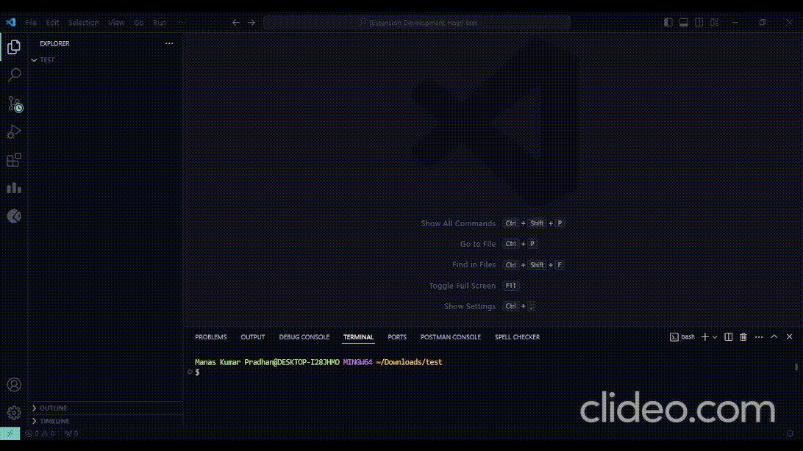
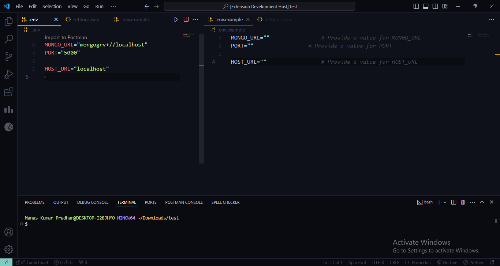
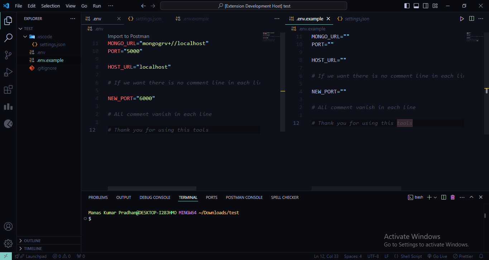
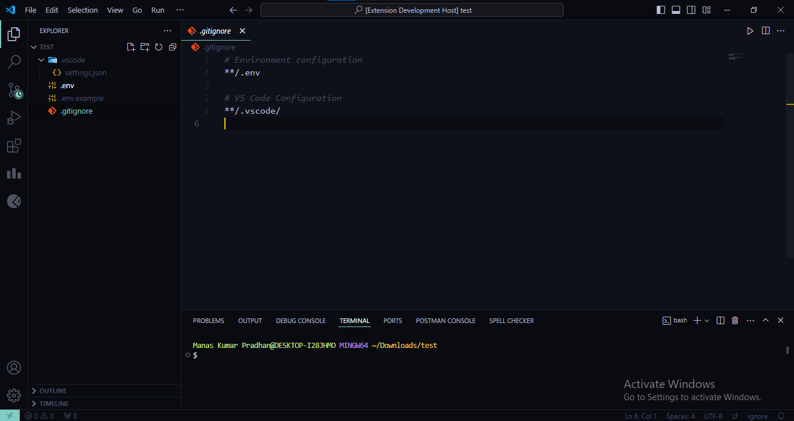
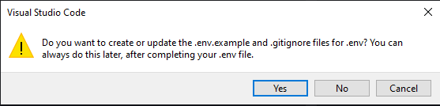

<h1 align="center">.env.example Generator Extension</h1>

## Table of Contents

1. [Overview](#overview)
1. [Features](#features)
1. [Installation](#installation)
1. [Usage](#usage)
1. [Contributing](#contributing)

### BY [Manas Kumar Pradhan](https://manaskpradhan.vercel.app/)

<p align="left"> <a href="https://twitter.com/pkmanas22" target="blank"></a> </p>

## Overview

- The `.env.example` Generator is a Visual Studio Code extension that automatically generates `.env.example` files based on the existing `.env` files in your workspace.
- This ensures consistent environment variable configurations across your projects while also generating `.gitignore` files to exclude sensitive environment files from version control.

### Screenshot







## Features

- Automatically creates `.env.example` files from `.env` files in the workspace.
- Optionally includes comments in the generated `.env.`example file to guide developers.
- Automatically updates `.gitignore` files to ignore `.env` files.
- Debounced updates to handle rapid changes in `.env` files.
- Toggle comments in `.env.example` through workspace settings.

## Installation

### For using

1. Open Visual Studio Code.
2. Go to the Extensions view (Ctrl+Shift+X).
3. Search for `.env.example-generator` or click the link to the marketplace.
4. <a href="vscode:extension/manaskpradhan.env-example-generator" target="blank">Click Install</a>

### For contributing

- If you'd like to contribute to the development of this extension, follow the setup instructions below:

- Setup for Development

#### 1. Clone the repository:

```
git clone https://github.com/pkmanas22/.env.example-generator-extension.git

cd .env.example-generator-extension
```

#### 2. Install dependencies:

You’ll need Node.js installed (preferably version 18.x or later). Then, run the following command to install dependencies:

```
yarn install
```

#### 3. Open the project in VS Code:

Open the project folder in Visual Studio Code:

```
code .
```

#### 4. Launch Extension:

Press `F5` to start the extension in a new VS Code window (Extension Development Host).

## Usage

#### 1. Enable Automatic .env.example Generation:

The extension will automatically generate and update `.env.example` files whenever you modify `.env` files in your workspace.

#### 2. Permissions:

When a `.env` file is detected, you may be prompted to confirm if you want to create or update`the`.env.example` and .gitignore` files. You can choose to do this immediately or later.



#### 3. Toggle Comments in .env.example:

You can enable or disable the inclusion of comments in the `.env.example` files by changing the workspace setting:

1. Open Command Palette `(Ctrl+Shift+P)`.
2. Search for `Toggle Include Comments in .env.example`.
3. Toggle between enabling or disabling comments.

```
.vscode\settings.json

{
    "envExample.includeComments": false
}
```

## Contributing

#### 1. Fork and clone the repository:

```
git clone https://github.com/[YOUR_USER_NAME]/.env.example-generator-extension
```

#### 2. Create a new branch:

```
git checkout -b feature/your-feature-name
```

#### 3. Make your changes and commit them:

```
git commit -m "Add your changes"
```

#### 4. Push your changes:

```
git push origin feature/your-feature-name
```

#### 5. Submit a Pull Request to the main repository.

_Thank you for reading!_
