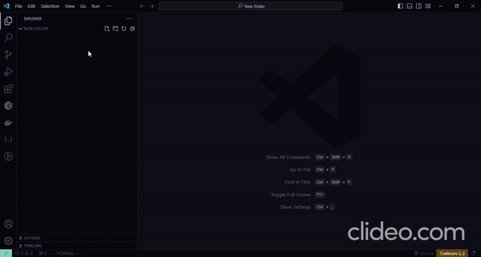

<h1 align="center">.env.example-generator</h1>

### BY [Manas Kumar Pradhan](https://manaskpradhan.vercel.app/)

  

### .env.example generator - A Visual Studio Code extension

## Description

`env-example-generator` is a Visual Studio Code extension that automatically generates `.env.example` files based on existing `.env` files in your workspace. Simplify your development process by ensuring consistent environment variable configurations across your projects. Additionally, it automatically generates `.gitignore` files to exclude sensitive environment files from version control.

## Features

- Automatically generate `.env.example` files based on existing `.env` files.
- Automatically generate `.gitignore` files to exclude sensitive environment files from version control.

## Installation

1. Open Visual Studio Code.
2. Go to the Extensions view by clicking on the square icon in the sidebar.
3. Search for `env-example-generator`.
4. Click on the Install button.
5. Reload Visual Studio Code to complete the installation.

## Usage

1. Open your workspace in Visual Studio Code.
2. Ensure you have a `.env` file in your workspace.
3. The extension will automatically generate a corresponding `.env.example` file and `.gitignore` file in the root of your workspace.
4. Customize the generated `.env.example` file as needed.

## Commands

- **.env.example Generator**: Generate .env.example file.

## Requirements

- Visual Studio Code ^1.88.0

## Contributing

Contributions are welcome! Please feel free to submit a pull request.

## License

This project is licensed under the MIT License

**Enjoy!**
